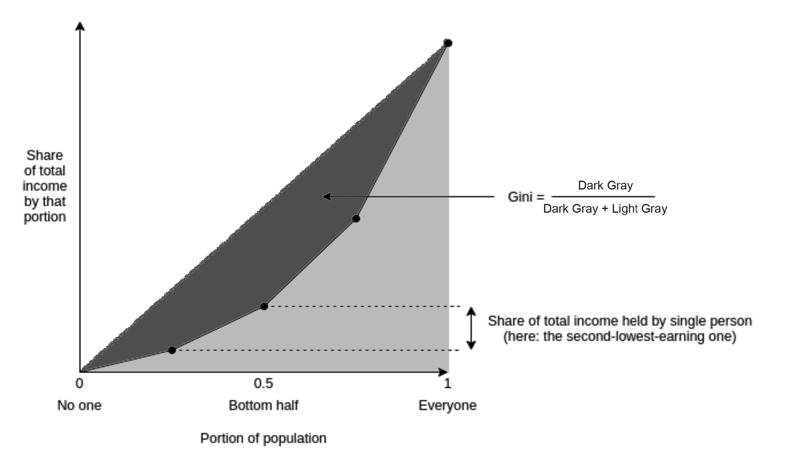

# ProofOfStake 번역

: 갈색 하이라이트 밑줄은 번역자 개인의 편집 관련 의견입니다.

---

[POS 번역](https://www.notion.so/POS-c70cd4f7b1bb48c1ab2a966e36bd5910) 

# [샘플 번역]

## **AGAINST OVERUSE OF THE  GINI COEFFICIENT(p253~p255)**

지니 계수(지니 지수)는 가장 유명하고 널리 알려진 불평등의 정도를 나타내는 지수이다. 특정 국가, 영토 또는 공동체에서 소득 또는 부의 불평등의 정도를 측정하는 데 주로 이용하고 있다. 그래프로 간단히 시각화할 수 있는 수학적 모델을 정의하고 있어 이해가 쉽고 인기가 많다.

하지만, 불평등성을 하나의 숫자로 줄이려는 어떤 계획에서도 예상할 수 있듯이 지니 계수 또한 한계가 있다. 국가의 소득과 부의 불평등을 계수화한다는 본래의 맥락에서도 한계가 있지만 지니계수를 다른 영역(특히 암호화폐)에 적용할 때 더욱 그 한계가 드러난다. 나는 이 글에서 지니계수의 한계를 설명하고 대체 모델을 제안한다.

### 지니 계수란?

지니 계수는 불평등의 정도를 나타내는 지수로 Corrado Gini에 의해 1912년 소개되었다. 국가의 소득과 부의 불평등의 정도를 측정하는 데 주로 사용한 지수였으나, 다른 영역에서도 점차 더 많이 확대 적용되고 있다.

지니 계수는 다음과 같은 두 가지 정의가 있다.

- 곡선 위 영역 정의: 함수 그래프를 그려보자. $f(p)$는 모집단 중 가장 낮은 소득층이 벌어들인 총소득이다. (e.g., $f(0.1)$은 하위 10% 소득자가 벌어들인 총소득을 의미한다.) 지니 계수는 $f(p)$ 곡선과 $y=x$ 대각선 사이의 면적을 의미하며, 전체 삼각형내 차지 비율이다.
[그래프]
x: 인구 누적 비율(%), y: 소득 누적 비율(%)
특정 소득 구간 인구의 누적 소득 비율(여기서는 두 번째로 낮은 소득 구간의 사람을 의미)
No one, Bottom half, Everyone ⇒ x축에 0, 0.5, 1로 표기되어 있어 없어도 될 것 같습니다
    
    
    

$$
Gini = \cfrac{어두운 영역}{어두운 영역 + 밝은 영역}
$$

- 평균-차이 정의: 지니 계수는 모든 가능한 개별 쌍 간 소득의 평균 차이를 평균 소득으로 나눈 값의 절반이다.
예를 들어, 위 차트 예시에서 네 개의 소득 [1, 2, 4, 8]은 16개의 차이가 있음 [0, 1, 3, 7, 1, 0, 2, 6, 3, 2, 0, 4, 7,  6, 4, 0]. 따라서 평균 차이는 2.875이고 평균 소득은 3.75이다. 따라서 지니 계수는 아래와 같다.

$$
\cfrac{2.875}{2 \times 3.75}\approx0.3833
$$

이 둘은 수학적으로 동등한 것으로 밝혀졌다. (증명은 독자분들의 과제!)

### 지니 계수의 문제점은 무엇인가?

지니 계수는 합리적이고 간단하면서 이해하기 쉬운 통계 지수이기 때문에 매력적이다. 간단해 보이지 않을 수 있지만 나를 믿어주길 바란다. 임의의 크기의 인구를 다루는 통계의 거의 모든 것이 복잡하고 종종 훨씬 더 어렵다. 여기, 가장 기초적이고 기초적인 표준 편차 공식을 보아라.

$$
\sigma=\cfrac{\sum_{i=1}^{n}{x^2_i}}{n}-(\cfrac{\sum_{i=1}^{n}{x_i}}{n})^2
$$

그리고 여기 지니 공식이다.

$$
G=\cfrac{2\times{\sum_{i=1}^{n}{i}}\times{x_i}}{n\times\sum_{i=1}^{n}{x_i}}-\cfrac{n+1}{n}
$$

익숙해질 것이다. 약속한다!

그럼 무엇이 문제일까? 사실 여기에는 많은 문제점이 있다. 지니 계수의 다양한 문제점을 다루는 수많은 글이 존재한다. 이 글에서 나는 충분히 논의되지 않았다고 생각되는 한 가지 문제점에 초점을 맞출 것이다. 그것은 인터넷 커뮤니티의 불평등을 해석하는 것과 특히 관련이 있다.